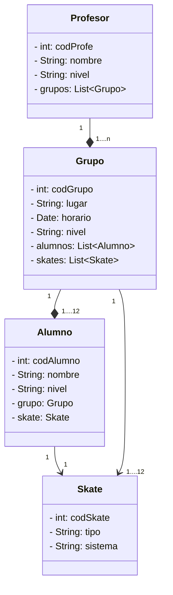

# 🛹 ClasesSkate

Aplicación de gestión de grupos de una escuela de skate desarrollada en **Java** con arquitectura en capas y patrón **DAO** (Data Access Object).

---

## 📋 Descripción

**ClasesSkate** permite gestionar los grupos de clases de una escuela de skate. La aplicación organiza profesores, alumnos y material (skates) en grupos con horario y nivel asignados.

El usuario interactúa con el sistema a través de un **menú de consola** que permite:

- Obtener un grupo de forma aleatoria.
- Buscar un grupo por su código identificador.
- Consultar el total de grupos registrados.

---

## 🏗️ Estructura del proyecto

```
src/
├── main/
│   └── java/
│       └── org/palomafp/clasesskate/
│           ├── App.java              # Punto de entrada + menú de consola
│           ├── GruposDAO.java        # Capa de acceso a datos (DAO)
│           └── modelo/
│               ├── Profesor.java     # Entidad Profesor
│               ├── Grupo.java        # Entidad Grupo
│               ├── Alumno.java       # Entidad Alumno
│               └── Skate.java        # Entidad Skate
└── test/
    └── java/
        └── org/palomafp/clasesskate/
            ├── AppTest.java          # Test básico de la aplicación
            └── SkateDaoTest.java     # Tests unitarios del DAO
```

---

## 📐 Diagrama de clases



---

## 🧩 Descripción de las clases

### `Skate`
Representa una patineta disponible en la escuela. Almacena el código identificador, el tipo de tabla y el sistema (marca).

### `Alumno`
Representa un alumno matriculado. Tiene un nivel de habilidad (`L1`–`L4`) y puede estar asignado a un `Grupo` y a un `Skate`.

### `Profesor`
Representa un profesor de la escuela. Tiene un nivel de especialización y gestiona una lista de grupos que imparte.

### `Grupo`
Agrupa a alumnos bajo un profesor, en una pista concreta (`lugar`), con un horario y nivel determinados. También tiene asignados skates para su uso en clase.

### `GruposDAO`
Capa de acceso a datos. Inicializa los datos en memoria e implementa las operaciones de consulta:

| Método | Descripción |
|---|---|
| `getAllGrupos()` | Devuelve la lista completa de grupos |
| `getGrupoByCodigo(int)` | Busca un grupo por su código |
| `getGrupoRandom()` | Devuelve un grupo aleatorio |

### `App`
Clase principal con el método `main`. Gestiona el menú interactivo por consola mediante un bucle `do-while` y un `switch`.

---

## ▶️ Cómo ejecutar

### Requisitos

- Java 11 o superior
- Maven 3.x

### Compilar y ejecutar

```bash
mvn compile
mvn exec:java -Dexec.mainClass="org.palomafp.clasesskate.App"
```

### Ejecutar los tests

```bash
mvn test
```

---

## 🧪 Tests incluidos

Los tests se encuentran en `SkateDaoTest.java` y cubren los siguientes casos:

| Test | Descripción |
|---|---|
| `testGetAllGrupos` | Verifica que se devuelven exactamente 4 grupos |
| `testGetGrupoByCodigoExistente` | Busca el grupo con código 2 y comprueba sus datos |
| `testGetGrupoByCodigoNoExiste` | Verifica que devuelve `null` para un código inexistente |
| `testGetGrupoRandom` | Comprueba que el grupo aleatorio no es nulo y tiene un código válido |
| `testGetGrupoRandomNulo` | Verifica que devuelve `null` cuando la lista está vacía |

---

## 📦 Tecnologías utilizadas

| Tecnología | Uso |
|---|---|
| Java | Lenguaje principal |
| Maven | Gestión de dependencias y build |
| JUnit 5 | Framework de testing |

---

## 👤 Autor

Sergio y Débora.
Proyecto desarrollado para la asignatura de Entornos de Desarrollo.